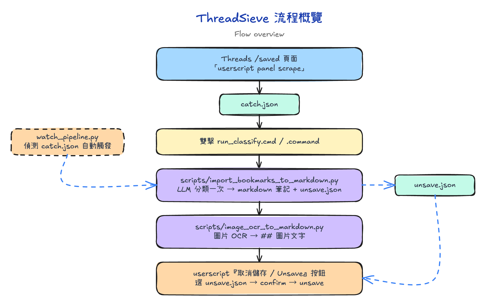

# ThreadSieve (full / power-user)

[English](README.en.md)

> **最新更新（2026-07-20）**：取消儲存機制整個換掉（userscript 0.5.4）——不再捲動 /saved 巡覽，改為逐篇開分頁執行，不受 Threads 收藏列表載入深度限制；只處理 `unsave.json` 明列貼文，已取消過的自動跳過，重複執行安全。需一次性允許 `www.threads.com` 彈出式視窗。完整紀錄見 [RELEASE_NOTES.md](RELEASE_NOTES.md)。

> **此分支為 power-user 版本**，包含 `watch_pipeline.py`、`agent_driver.py`、Chandra/vLLM OCR backend，需要 Node.js、Claude Code + `superpowers-chrome` plugin、Chrome `--remote-debugging-port=9222`。  
> 只想 **雙擊跑、不裝 plugin、不開 terminal** 的一般使用者請改用 [`lite` 分支](https://github.com/hikarushane/thread-sieve)（即 repo 預設 branch）。

Threads 收藏貼文的問題：

  ❌ 存了幾百篇
  ❌ 沒有分類
  ❌ 找不到
  ❌ 最後全部爛在那裡

ThreadSieve 是一套本機端自動化流程，把 Threads 收藏貼文篩選、分類，轉成 markdown 筆記，並以一鍵按鈕取消儲存指定分類的貼文。

抓取後進入分類與筆記產生的貼文內容包含：主文內容、作者在同串貼文中的留言，以及貼文圖片經 OCR 轉出的文字。若收藏的是某則回應，筆記還會附上該回應的單線上文脈絡（母帖到回應的完整一條線）與回覆區（原帖作者的回覆與有內容的留言，摺疊呈現）。

這個 repo 包含兩層：

- `userscripts/threads-scriber-auto.user.js`：Tampermonkey userscript，抓 Threads saved 頁面寫出 `catch.json`。
- `scripts/*.py`：Python pipeline，LLM 分類、寫 markdown、圖片 OCR、agent-driven browser 操作。

---

## 流程概覽



完成安裝後有兩條使用路徑：**免打字（雙擊執行）**（瀏覽器 panel scrape + 雙擊 `run_classify.cmd`／`.command`）或**開 Terminal**（watcher 自動偵測 `catch.json` 觸發 + agent-driven scrape）。

---

## 前置需求

| 需求 | 用途 |
| --- | --- |
| Python 3.10+（用一行安裝則免預裝，uv 會自動下載 3.12） | classifier + markdown 產生器 + 圖片 OCR |
| Google Chrome / Edge | 瀏覽器 |
| Tampermonkey extension | 載入 userscript |
| LLM API key（Gemini／Anthropic／OpenAI 擇一，預設 Gemini） | 分類 + 標題 + 圖片 OCR |
| Node.js 18+（僅路徑二） | 執行 `chrome-ws` CLI |
| Claude Code + [`superpowers-chrome`](https://github.com/obra/superpowers-chrome) plugin（僅路徑二） | 提供 `agent_driver.py` 和 `push_userscript.py` 需要的 `chrome-ws` CLI |

---

## 安裝

### 0. 一行安裝（Clone＋Python 環境）

**Windows（PowerShell）：**

```powershell
irm https://raw.githubusercontent.com/hikarushane/thread-sieve/main/install.ps1 | iex
```

**macOS（Terminal）：**

```bash
curl -fsSL https://raw.githubusercontent.com/hikarushane/thread-sieve/main/install.sh | bash
```

一行做完：clone repo → 自動安裝 [uv](https://docs.astral.sh/uv/)（若沒有）→ 建立 Python 3.12 虛擬環境 → 安裝依賴與 Chromium → 產生 `.env`／`config.json`。**系統已裝其他版本的 Python 也沒關係**：uv 會自動下載正確版本、只用在此專案的 `.venv`，不會動到你原本的環境。

> 注意：一行安裝 clone 的是預設分支（`main`，即 lite）。要使用此 full 分支，安裝完成後進專案目錄執行 `git checkout full`。

<details>
<summary>不想 <code>curl | bash</code>？手動安裝步驟在此</summary>

```powershell
# Windows（PowerShell）；需 Python 3.10+
git clone https://github.com/hikarushane/thread-sieve.git
cd thread-sieve
python -m venv .venv
.\.venv\Scripts\Activate.ps1
pip install -r requirements.txt
playwright install chromium
copy .env.example .env
copy config.json.example config.json
```

```bash
# macOS（Terminal）；需 Python 3.10+
git clone https://github.com/hikarushane/thread-sieve.git
cd thread-sieve
python3 -m venv .venv
source .venv/bin/activate
pip install -r requirements.txt
playwright install chromium
cp .env.example .env
cp config.json.example config.json
```

</details>

### 1. 填設定

編輯 `.env`：填入你選用 provider 的 API key（預設 Gemini → `GEMINI_API_KEY`；換 provider 見下方「LLM provider 選擇」）。

編輯 `config.json`：

| Key | 要填什麼 |
| --- | --- |
| `paths.catch-json` | `data/catch.json` 的路徑（相對或絕對） |
| `paths.unsave-json` | `data/unsave.json` 的路徑（相對或絕對） |
| `paths.markdown-output-root` | markdown 筆記輸出目錄（預設 `output`） |
| `paths.chrome-ws-cli` | 步驟 0 安裝的 `chrome-ws` CLI 完整路徑 |
| `categories` | Gemini classifier 可輸出的分類清單（依優先順序排列） |
| `unsaved-categories` | `categories` 的子集；這些分類的貼文會寫入 `unsave.json` |
| `hints` | 注入 classifier prompt 的判斷補充說明，用於邊界情境 |
| `llm.provider`（可選） | `gemini`（預設）／`anthropic`／`openai` |

`category-overrides` 是可選欄位，可設定關鍵字或 regex 規則，在呼叫 LLM 前強制指定分類。

ThreadSieve 已內建 markdown note generator (`scripts/import_bookmarks_to_markdown.py`)，不再呼叫外部 `PROJECT_threads-to-note` repo。markdown 筆記會寫到 `config.json` 的 `paths.markdown-output-root`，預設是 `output`。

### 2. `superpowers-chrome`（`agent_driver.py` 必要；僅路徑二）

`agent_driver.py` 會透過 [`superpowers-chrome`](https://github.com/obra/superpowers-chrome) plugin 附帶的 `chrome-ws` Node.js CLI 控制已登入的 Chrome。設定 `--remote-debugging-port=9222` 之前，請先確認這個 CLI 已安裝並寫進 `config.json`。

#### A. 安裝 plugin

在 Claude Code 中，從 `obra/superpowers-marketplace` marketplace 安裝 `superpowers-chrome`：

```text
/plugin marketplace add obra/superpowers-marketplace
/plugin install superpowers-chrome@superpowers-marketplace
```

安裝後，`chrome-ws` CLI 通常會在類似下面的位置；實際版本號請以你本機安裝的目錄為準。

```text
C:\Users\<you>\.claude\plugins\cache\superpowers-marketplace\superpowers-chrome\2.1.0\skills\browsing\chrome-ws
```

確認 Node.js 可以執行它：

```powershell
node "C:\Users\<you>\.claude\plugins\cache\superpowers-marketplace\superpowers-chrome\2.1.0\skills\browsing\chrome-ws" --help
```

#### B. 設定 `config.json`

`agent_driver.py` 和 `push_userscript.py` 都需要 `chrome-ws` CLI 路徑。請在 `config.json` 設定：

```json
"paths": {
  "chrome-ws-cli": "C:/Users/<you>/.claude/plugins/cache/superpowers-marketplace/superpowers-chrome/2.1.0/skills/browsing/chrome-ws"
}
```

舊的 `CHROME_WS_PATH` 環境變數仍可作為相容覆寫；新的安裝建議使用 `config.json`。

#### C. 用 remote debugging 啟動 Chrome

執行任何 `agent_driver.py` 指令之前，Chrome 必須先用 `--remote-debugging-port=9222` 啟動。

`superpowers-chrome` 也可以用 `chrome-ws start` 啟動 Chrome，但預設行為可能會選擇動態 port。ThreadSieve 的 scripts 和本機 hook 目前都預期使用 `9222`，所以建議使用下面的固定 port 啟動方式。如果你改用 `chrome-ws start`，請用 `--port=9222` 或 `CHROME_WS_PORT=9222` 固定 port。

Chrome 136 之後，remote debugging 不能直接使用預設 Chrome profile，必須搭配非預設的 `--user-data-dir`。這個資料夾就是另一個 Chrome profile；Tampermonkey、userscript、Threads login cookie 都存在這裡。每次都用同一個 `--user-data-dir`，才不用一直重裝和重新登入。

啟動前先把所有 Chrome 視窗關掉，否則 Windows 可能沿用已經啟動、但沒有 `--remote-debugging-port=9222` 的 Chrome process。

```powershell
$profileDir = Join-Path $env:LOCALAPPDATA "ThreadSieve\ChromeDebugProfile"
New-Item -ItemType Directory -Force $profileDir | Out-Null
Start-Process "chrome.exe" -ArgumentList @(
  "--remote-debugging-port=9222",
  "--user-data-dir=`"$profileDir`"",
  "https://www.threads.com/saved"
)
```

如果找不到 `chrome.exe`，改用完整路徑：

```powershell
Start-Process "$env:ProgramFiles\Google\Chrome\Application\chrome.exe" -ArgumentList @(
  "--remote-debugging-port=9222",
  "--user-data-dir=`"$profileDir`"",
  "https://www.threads.com/saved"
)
```

日常使用時也可以做一個專用捷徑：

1. 複製桌面或工作列上的 Chrome 捷徑。
2. 右鍵 -> 內容 -> 目標，在原本內容後面加上 ` --remote-debugging-port=9222 --user-data-dir="%LOCALAPPDATA%\ThreadSieve\ChromeDebugProfile" https://www.threads.com/saved`。
3. 以後都用這個捷徑開啟 Chrome，並在這個 debug profile 裡安裝 Tampermonkey、登入 Threads。

```text
"C:\Program Files\Google\Chrome\Application\chrome.exe" --remote-debugging-port=9222 --user-data-dir="%LOCALAPPDATA%\ThreadSieve\ChromeDebugProfile" https://www.threads.com/saved
```

確認 9222 port 有開：

```powershell
Invoke-WebRequest http://localhost:9222/json | Select-Object -Expand Content
```

看到一段 tabs JSON 就代表 `agent_driver.py` / `push_userscript.py` 可以連上。

#### D. Agent hooks 會檢查這個前置條件

這個 repo 內建 Claude Code 和 Codex 的本機 hook：

- `.claude/settings.json` 會在 Claude Code shell command 前執行 `.claude/hooks/check-chrome-debug.ps1`。
- `.codex/hooks.json` 會透過 `.codex/check-chrome-debug.cmd` 執行 `.codex/check-chrome-debug.ps1`。

這兩個 hook 只攔截 `agent_driver.py` 和 `push_userscript.py`。如果 `127.0.0.1:9222` 連不上，它們會阻止指令繼續執行，避免 agent 誤開沒有 debug port 的新 browser 或改成手動操作 Tampermonkey。

---

### 3. Browser 端（一次性設定）

1. 使用上方設定好的 debug profile 啟動 Chrome（只走路徑一的話，一般 Chrome / Edge 即可），前往 `https://www.threads.com/saved`，並保持這個 tab 開著。
2. 在這個 Chrome profile 安裝 [Tampermonkey](https://www.tampermonkey.net/)。
3. 如果你曾在同一個 Tampermonkey profile 安裝過 `threads-scriber.user.js`，請先停用它；第一次安裝 ThreadSieve 可略過這步。
4. 安裝 `userscripts/threads-scriber-auto.user.js`。
5. Reload `/saved`。會出現 **ThreadSieve** panel（userscript 0.4.1 起已無 Auto AI Sync 面板）。

`catch.json` 自動存檔授權與 `agent_driver.py probe` 檢查放在日常使用 SOP。Chrome 的 File System Access handle 可能需要每次重新授權，第一次安裝時不用把它視為永久設定。`unsave.json` 不做持久綁定——每次執行取消儲存都重新選檔（刻意設計）。

---

## 日常使用 SOP

兩條使用路徑，依環境選擇：

| | 路徑一：免打字（雙擊執行） | 路徑二：Terminal watcher + agent scrape |
| --- | --- | --- |
| 需要 `agent_driver.py` | 否 | 是 |
| 需要 Chrome debug port | 否 | 是 |
| 分類觸發方式 | 雙擊 `run_classify.cmd`／`.command` | 自動（watcher 偵測 `catch.json`）|
| 適合 | 偶爾使用、快速跑一次 | 日常自動化 |

---

### 路徑一：免打字（雙擊執行）

用瀏覽器 panel 手動 scrape，再雙擊 `run_classify.cmd`／`.command` 跑一次 classify。全程不需手打指令。

#### 步驟 1：準備瀏覽器

1. 開啟 Chrome，前往 `https://www.threads.com/saved`。
2. 如果 panel 還沒出現，先 reload `/saved`，讓 **ThreadSieve panel** 載入。
3. 在 ThreadSieve panel 點 **設定自動存檔**，選 `data/catch.json`。

#### 步驟 2：用 panel 觸發 scrape

1. 在 ThreadSieve panel 的日期欄輸入截止日期。
2. 點 **清空結果** 清除上次的殘留。
3. 點 **開始抓取**，等 `狀態` 顯示 `完成` 或 `待機中`。

#### 步驟 3：執行 classify

- **Windows**：雙擊專案根目錄的 `run_classify.cmd`。
- **macOS**：雙擊專案根目錄的 `run_classify.command`（首次可能需 `chmod +x run_classify.command`，或右鍵 → 打開以繞過 Gatekeeper）。

會跳出一個 console／Terminal 視窗，自動 activate `.venv` 並執行 `scripts/import_bookmarks_to_markdown.py`。執行中會逐筆顯示進度 `[n/總數] 標題 分類`（已存在的標「已存在，略過」），結尾顯示總結行（共 X 個書籤、進度、markdown 存檔路徑），最後顯示 `[DONE]` 或 `[FAILED]`，按任意鍵關閉。

若想做桌面捷徑：

- **Windows**：右鍵 `run_classify.cmd` → 傳送到 → 桌面（建立捷徑）。
- **macOS**：對 `run_classify.command` 按 ⌥⌘ 拖到桌面建立替身（alias）。

之後雙擊捷徑即可。

這支 script 對每篇貼文分類一次，並用同一批分類結果寫出 markdown 筆記和 `unsave.json`。若分類結果符合 `config.json` → `image-ocr.trigger-categories`，圖片 OCR 也會自動執行。

備案：如果偏好用指令列執行，仍可開 PowerShell 跑：

```powershell
# Windows
.\.venv\Scripts\Activate.ps1
python scripts/import_bookmarks_to_markdown.py
```

```bash
# macOS
source .venv/bin/activate
python scripts/import_bookmarks_to_markdown.py
```

#### 步驟 4：在瀏覽器確認 unsave

在 ThreadSieve panel 點大按鈕 **取消儲存** → 檔案選擇器選 `data/unsave.json` → confirm 對話框確認後，腳本逐篇用新分頁開啟清單內的貼文，自動點「⋯ → 取消儲存」後關閉分頁換下一篇，面板即時顯示進度（已取消／跳過／失敗）。

- **首次使用需一次性設定**：Chrome 對 `www.threads.com` 允許彈出式視窗（首次執行被擋時面板會提示，點網址列右側圖示允許即可）。
- 只會處理 `unsave.json` 明列的貼文；貼文選單顯示「儲存」（代表其實未收藏，例如先前已取消過）會自動跳過——重複執行安全。
- 執行中按鈕變「停止逐篇取消」，可隨時喊停；連續 5 篇失敗會自動中止。

每次執行都要重新選檔——這是刻意設計：選檔動作即是「用的是最新分類結果」的確認，避免拿舊檔誤執行。

---

### 路徑二：Terminal watcher + agent scrape（自動化）

全流程自動執行。需要 Chrome 帶 `--remote-debugging-port=9222`，以及 `config.json` → `paths.chrome-ws-cli` 已設定。

#### Terminal A：啟動 watcher

```powershell
cd path\to\threads-sieve
.\start_pipeline.ps1
```

log 會輸出到 console 和 `pipeline.log`。停止時按 `Ctrl+C`。

#### Terminal B：agent-driven scrape

先準備 browser 端：

1. 用安裝階段設定好的同一個 debug profile 啟動 Chrome，並帶上 `--remote-debugging-port=9222`。
2. 開啟 `https://www.threads.com/saved`，並保持這個 tab 開著。
3. 如果 panel 還沒出現，先 reload `/saved`，讓 **ThreadSieve panel** 載入。
4. 在 ThreadSieve panel 點 **設定自動存檔**，選 `data/catch.json`。

> **userscript 0.4.2（full 分支版）**：0.4.1 移除了 Auto AI Sync 面板與自動 unsave；full 分支的 userscript 在其上加回 agent bridge（`window.ThreadSieveAgent`），讓 Terminal B 確認 gate 把 `unsave.json` 內容直接注入頁面執行一鍵流程。terminal 的 `y/n` 取代選檔確認——執行當下才從磁碟重新讀檔，防舊檔誤執行的保證不變。路徑二請安裝 **full 分支**的 `userscripts/threads-scriber-auto.user.js`（0.4.2）。

再確認 panel ready：

```powershell
python scripts/agent_driver.py probe
```

Expected output 最後一行：`OK: panel ready for agent-driven scrape`

**若 probe 回報問題：**

| 問題 | 處理方式 |
| --- | --- |
| `panel missing` | reload `/saved`；等 Tampermonkey inject |
| `scriptVersion=X expected 0.4.2` | 裝的不是 full 分支版 userscript（例如還是 lite 的 0.4.1，沒有 agent bridge） | 重新安裝 full 分支的 `userscripts/threads-scriber-auto.user.js` |
| `autosave (catch.json) not bound` | 點 **設定自動存檔**，選 `data/catch.json`；re-run probe |

觸發 scrape：

```powershell
# 抓全部（自 2010）：
python scripts/agent_driver.py scrape --cutoff 2010-01-01 --wait-seconds 300

# 只抓近期（速度快、較少 Gemini tokens）：
python scripts/agent_driver.py scrape --cutoff 2025-01-01 --wait-seconds 120
```

`--cutoff` 會在 panel 設定日期後點 **開始抓取**。每次 scrape 會先點 **清空結果**，確保 `catch.json` 只含本次資料。`--wait-seconds` 定期 poll `狀態` 直到 idle（`待機中` / `完成` / `已停止`）或 timeout。

等待 Terminal A：`catch.json` 穩定後，watcher 啟動 notes workflow，分類一次並同時寫出 markdown 筆記和 `unsave.json`：

```
pipeline starting: items=N
[notes]    exit code: 0
```

`notes` 完成後，`image_ocr_to_markdown.py` 會對 `config.json` → `image-ocr.trigger-categories` 指定分類的貼文執行圖片 OCR，並把結果寫入 markdown 的 `## 圖片文字` 區塊。預設 OCR backend 是 Gemini；要切到 Chandra，改 `config.json` 的 `image-ocr.backend`。

Terminal B confirmation gate：watcher 寫出新 `unsave.json` 後，Terminal B 印出每個候選（`作者:<author>| 貼文:<first sentence>`）並問 `確認執行?(y/n)`：

- 輸入 `y`：從磁碟重新讀取 `unsave.json`、經 agent bridge 注入頁面執行一鍵取消儲存，回報 `verified/attempted/failed/remaining`。
- 輸入 `n`：`unsave.json` 保留不動，瀏覽器端不動。

加 `--no-unsave-confirm` 可跳過 gate（只觸發 scrape），之後改在瀏覽器 panel 手動點「取消儲存」。`--unsave-timeout-seconds`（預設 `600`）控制 gate 等待新 `unsave.json` 的最長秒數。

ThreadSieve panel 0.4.1 起僅保留 scrape 相關控制與單一「取消儲存」按鈕；舊版的手動工具、手動載入 AI classification、診斷面板已移除。

---

## 補舊 markdown 的圖片 OCR

使用 `scripts/backfill_image_ocr.py` 補洞：當某些舊 markdown 筆記是在圖片 OCR 功能之前產生的，可以用這個 script 回頭補 `## 圖片文字`。它會使用 `config.json` 指定的 image OCR backend。

預設候選條件：

- frontmatter 有 `status: stub`
- frontmatter 有 `網址` 或 `url`
- 檔案尚未包含 `## 圖片文字`
- 去掉 frontmatter、`## Sources`、既有 `## 圖片文字` 後，正文長度低於 `--min-content-chars`，預設 `800`

先 dry-run 預覽整個資料夾：

```powershell
python scripts/backfill_image_ocr.py --path "<wiki-folder>" --dry-run
```

寫出 JSONL log：

```powershell
python scripts/backfill_image_ocr.py --path "<wiki-folder>" --log data/backfill-image-ocr.jsonl
```

每個被檢查的 `.md` 都會有一筆 JSONL event，狀態可能是：

- `processed`
- `skipped`
- `failed`
- `no_images`

單篇失敗是 soft failure，不會中斷整批。

### 依指定日期補洞

`backfill_image_ocr.py` 沒有內建「修改日期」參數。指定日期補洞不是常見批次模式，建議交給 agent 先用檔案系統篩選，再逐檔呼叫 script。

範例 prompt：

```text
Use `scripts/backfill_image_ocr.py`.

請先遞迴掃描：
<wiki-folder>

只挑選檔案系統 LastWriteTime 日期為 YYYY-MM-DD 的 `.md` 檔案，
再逐檔執行 `scripts/backfill_image_ocr.py --path "<file>"`。

不要直接把整個 wiki folder 丟給 script。
script 內建條件照預設即可：只處理 `status: stub`、內文不夠詳細、
frontmatter 有 `網址` 或 `url`、且沒有 `## 圖片文字` 的檔案。

請產生 JSONL log，最後回報 processed / skipped / failed / no_images summary。
```

如果只想先檢查候選檔，在 prompt 補一句：

```text
第一輪請加 `--dry-run`，只回報候選檔與 summary，不要修改 markdown。
```

---

## LLM provider 選擇

ThreadSieve 的分類、標題、圖片 OCR 三個階段都走 LLM。預設使用 Google Gemini SDK，但可以在 `config.json` 或 `.env` 中切換成 Anthropic Claude 或 OpenAI ChatGPT。

| Provider  | `.env` API key 變數    | 預設 text model        | 預設 vision model      |
|-----------|------------------------|------------------------|------------------------|
| Gemini    | `GEMINI_API_KEY`       | `gemini-2.5-flash`     | `gemini-2.5-flash`     |
| Anthropic | `ANTHROPIC_API_KEY`    | `claude-sonnet-4-6`    | `claude-sonnet-4-6`    |
| OpenAI    | `OPENAI_API_KEY`       | `gpt-4o-mini`          | `gpt-4o`               |

切換方式（擇一）：

- `.env`: `LLM_PROVIDER=anthropic`
- `config.json` 加入：

  ```json
  "llm": { "provider": "anthropic" }
  ```

只需要在 `.env` 中填入你選用的那一個 provider 的 API key，其餘空白即可。

只支援 provider API、不支援本機 agent CLI（如 `claude -p`／`codex exec`）是刻意的設計決策——批量分類下 CLI 每次呼叫的啟動開銷、訂閱 quota 消耗與不可設 `temperature=0` 都不划算，詳見 [docs/decisions/ADR-001](docs/decisions/ADR-001-use-llm-provider-apis-not-agent-clis.md)。每個階段的 model 也可以單獨覆蓋（`THREADS_LLM_CLASSIFIER_MODEL` / `THREADS_LLM_TITLE_MODEL` / `THREADS_LLM_OCR_MODEL` 環境變數，或 `config.json` 的 `llm.text-model` / `title-model` / `vision-model`）。

注意：目前 `scripts/image_ocr_to_markdown.py` 的 CLI 路徑只支援 `--ocr-backend gemini`；多 provider 走的是主要 pipeline（`scripts/import_bookmarks_to_markdown.py` + workflow）。

---

## 存回應時的上文與回覆

收藏的若是一則回應（而非原帖），classify 階段會匿名開啟該貼文的 permalink，從頁面內嵌資料抽出：

- **上文脈絡**：從母帖到你收藏那則回應的完整單線，寫進筆記的 `## 上文脈絡` 區（blockquote 縮排，逐則標注 `@作者`）。
- **回覆區**：原帖作者的回覆（連同被回覆的留言成對呈現）與長度達門檻的留言，寫進 Obsidian 可摺疊 callout（`> [!quote]- 回覆（N 則…）`），預設收合。
- frontmatter 增加 `saved_kind: root|reply`，標記收藏的是原帖還是回應。

上文會一併餵給分類與標題生成（回覆不會），提升存回應時的分類準確度；不增加額外網路請求與 LLM quota。

---

## 設定

`config.json` 放非 secret 的通用設定、分類表和 OCR 行為：

| Key | Default | 用途 |
| --- | --- | --- |
| `paths.catch-json` | `data/catch.json` | userscript 寫入、classify／watcher 讀取 |
| `paths.unsave-json` | `data/unsave.json` | classify 寫出、userscript 讀取 |
| `paths.markdown-output-root` | `output` | markdown 筆記輸出 root；OCR 也會掃描這裡 |
| `paths.chrome-ws-cli` | required for browser automation | `agent_driver.py`、`push_userscript.py` 使用的 `chrome-ws` CLI（僅路徑二） |
| `categories` | example list | classifier 可輸出的分類 |
| `unsaved-categories` | example subset | 這些分類會輸出到 `unsave.json` |
| `category-overrides` | `[]` | keyword / regex 強制分類規則 |
| `hints` | example rules | 注入 classifier prompt 的判斷補充 |
| `llm.provider` | `gemini` | LLM provider：`gemini`／`anthropic`／`openai` |
| `llm.text-model` / `title-model` / `vision-model` | 依 provider | 各階段 model 覆蓋（留空用 provider 預設） |
| `image-ocr.backend` | `gemini` | `gemini` 或 `chandra`（Chandra 設定見下方） |
| `image-ocr.trigger-categories` | `["AI"]` | 哪些分類要做圖片 OCR |
| `thread-context.enabled` | `true` | 上文／回覆擷取開關；`false` 時行為與舊版相同 |
| `thread-context.min-reply-chars` | `12` | 留言至少幾個字才收進回覆區（原帖作者的回覆不受限） |
| `thread-context.max-replies` | `30` | 回覆區最多收錄幾「串」對話（一串可含多則；原帖作者的回覆全數保留、不計入上限。超過截斷並在 callout 標題註記） |

路徑可以用相對路徑或本機絕對路徑。Windows 絕對路徑在 JSON 內必須用 forward slash（`C:/Users/<you>/...`）或將每個反斜線改成 `\\`（`C:\\Users\\<you>\\...`）。單一 `\` 在 JSON 是 escape 字元，`"D:\shane\..."` 會觸發 `json.decoder.JSONDecodeError: Invalid \escape`。

`category-overrides` 範例：

```json
"category-overrides": [
  {
    "category": "Project",
    "keywords": ["project mercury"],
    "regex": ["#project\\b"]
  }
]
```

正常 watcher 路徑會在 `scripts/import_bookmarks_to_markdown.py` 裡分類一次，再用同一批分類結果寫出 markdown 筆記和 `unsave.json`。`scripts/classify_to_scribe_ai.py` 仍保留作為 standalone 相容/除錯指令；它的 CLI-only `--unsaved-categories` 覆寫只影響那次 standalone run。

舊的 `CATCH_PATH`、`UNSAVE_PATH`、`MARKDOWN_OUTPUT_PATH`、`THREADS_MARKDOWN_OUTPUT`、`CHROME_WS_PATH` 仍可作為相容覆寫，但新的設定請放在 `config.json`。

`.env` 常用欄位：

| Key | Default | 用途 |
| --- | --- | --- |
| `LLM_PROVIDER` | `gemini` | `gemini`／`anthropic`／`openai`（也可用 `config.json` 的 `llm.provider`） |
| `GEMINI_API_KEY` / `ANTHROPIC_API_KEY` / `OPENAI_API_KEY` | — | 只需填所選 provider 那一把 |
| `THREADS_LLM_CLASSIFIER_MODEL` / `THREADS_LLM_TITLE_MODEL` / `THREADS_LLM_OCR_MODEL` | provider 預設 | 各階段 model 覆蓋 |
| `CLASSIFIER_MODEL` / `IMAGE_OCR_MODEL` | — | legacy Gemini 覆蓋，仍可用；建議改用 `THREADS_LLM_*` |
| `IMAGE_OCR_ENABLED` | `true` | OCR step toggle |
| `THREADS_CONTEXT_ENABLED` | `true` | 覆蓋 `thread-context.enabled` |
| `THREADS_CONTEXT_MIN_REPLY_CHARS` | `12` | 覆蓋 `thread-context.min-reply-chars` |
| `THREADS_CONTEXT_MAX_REPLIES` | `30` | 覆蓋 `thread-context.max-replies` |
| `MODEL_CHECKPOINT` | `datalab-to/chandra-ocr-2` | `image-ocr.backend=chandra` 時的 Chandra model setting |
| `MAX_OUTPUT_TOKENS` | `12384` | Chandra max output tokens；可被 `image-ocr.max-output-tokens` 覆蓋 |
| `VLLM_API_BASE` | `http://localhost:8000/v1` | Chandra vLLM OpenAI-compatible endpoint |
| `VLLM_MODEL_NAME` | `chandra` | Chandra vLLM served model name |
| `VLLM_GPUS` | `0` | Chandra vLLM server GPU selection |
| `DEBOUNCE_SECONDS` | `2.0` | watcher debounce |
| `POLL_SECONDS` | `1.0` | watcher poll interval |

pipeline 會在輸出目錄寫 `threads_events.jsonl` 事件紀錄；上文／回覆擷取結果對應 `reply_fetch_fetched_structured`（結構化解析成功）與 `reply_fetch_fetched_fallback`（退回純文字解析）事件。

`config.json` 裡的 `image-ocr` 是非 secret 的 OCR 行為設定：

```json
"image-ocr": {
  "backend": "gemini",
  "method": "vllm",
  "prompt-type": "ocr_layout",
  "max-output-tokens": 12384,
  "include-headers-footers": false,
  "trigger-categories": ["AI", "Claude Code"]
}
```

`backend` 可設為 `gemini` 或 `chandra`。使用 Chandra 時，`method=vllm` 會呼叫 `.env` 中 `VLLM_*` 指向的 OpenAI-compatible endpoint。`.env.example` 中的 Chandra 預設值來自 [datalab-to/chandra](https://github.com/datalab-to/chandra)；最新設定請以 upstream repo 為準。CLI 參數如 `--ocr-backend chandra` 和環境變數如 `IMAGE_OCR_BACKEND=chandra` 仍可作為單次 override。

---

## 測試

```powershell
cd path\to\threads-sieve
.\.venv\Scripts\Activate.ps1
pytest tests/
```

測試涵蓋：

- `classify_to_scribe_ai.py` standalone 相容分類輸出
- `import_bookmarks_to_markdown.py` 單次分類同時供 markdown 和 `unsave.json` 使用
- `watch_pipeline.py`
- `image_ocr_to_markdown.py`，包含 OCR backend selection
- `backfill_image_ocr.py`

---

## 已知限制

- 取消儲存需要瀏覽器停在 `/saved`（不在時按鈕會直接報錯），且 Chrome 需允許 `www.threads.com` 的彈出式視窗。
- 重新抓取前建議先按「清空結果」：帶著前次舊資料續抓會把已取消的貼文再次寫進 `catch.json`，讓下一輪分類重複列入；面板偵測到超過 6 小時的舊資料時會主動提醒。
- File System Access 授權視為每次日常使用前的準備步驟；「設定自動存檔」的授權遺失時重新設定即可。`unsave.json` 不做持久綁定——每次執行取消儲存都重新選檔（刻意設計）。
- markdown image OCR 會掃描 markdown root；若不想使用預設 `output`，請設定 `config.json` 的 `paths.markdown-output-root`。
- OCR 會用 Playwright render Threads post；若缺 browser binary，執行 `playwright install chromium`。
- LLM quota：每次 classify 對每篇貼文分類一次，接著為 markdown 標題再各呼叫一次；圖片 OCR 也消耗同一把 API key 的 quota。
- 回覆區只收「匿名可見」的回覆：深層回覆與登入後才看得到的內容不會收錄。
- Threads 改版可能使內嵌資料解析失效；此時自動退回舊的純文字解析（該篇筆記暫時沒有上文與回覆區，主文不受影響），`saved_kind` 會以 best-effort 標為 `root`。
- Chandra OCR 是 optional；若 `image-ocr.backend=chandra` 且 `method=vllm`，需要 `.env` 的 `VLLM_API_BASE` 指向可連線的 Chandra/vLLM server。
- Chandra CLI 仍需要可用 backend：`chandra --method vllm` 是 client，仍要有 vLLM server；`chandra --method hf` 是本機模型，但 Chandra OCR 2 會下載 10GB+ 模型，在低資源 Windows 機器上可能非常慢或失敗。沒有合適 Chandra backend 時，請使用 Gemini OCR。

---

## Troubleshooting

| 現象 | 可能原因 | 處理方式 |
| --- | --- | --- |
| 雙擊 `run_classify.cmd`／`run_classify.command` 顯示 `.venv not found` | 還沒建 venv | 跑一次「安裝 → 一行安裝」（依作業系統選指令） |
| watcher 顯示 missing required config | `config.json` 路徑空白 | 檢查 `paths.catch-json` 和 `paths.unsave-json` |
| classify 顯示 `json.decoder.JSONDecodeError: Invalid \escape` | `config.json` 的 Windows 路徑用了單一 `\` | 改成 `/`（`D:/foo/bar`）或 `\\`（`D:\\foo\\bar`） |
| classify／notes workflow 顯示 `<PROVIDER>_API_KEY missing` | `.env` 沒填所選 provider 的 key，或 subprocess 沒拿到 env | 確認 `.env` 有對應的 `..._API_KEY=...`；雙擊重跑或重啟 watcher |
| `catch.json` 寫入但 watcher 沒動 | mtime 落在 debounce window | 等 `DEBOUNCE_SECONDS` 或調小 `POLL_SECONDS` |
| OCR 顯示 `GEMINI_API_KEY missing` | `image-ocr.backend=gemini` 但沒有 key | 設定 `GEMINI_API_KEY`，或把 `config.json` 的 `image-ocr.backend` 改成 `chandra` |
| Chandra OCR 連不到 vLLM | `image-ocr.backend=chandra` 但 `VLLM_API_BASE` 不可連線 | 啟動 Chandra/vLLM server，或修正 `VLLM_API_BASE` |
| 取消儲存按鈕沒動作 | 不在 `/saved` 頁，或選檔時按了取消 | 把 tab 切回 `https://www.threads.com/saved`，重新點按鈕選檔 |
| 逐篇取消開了 1–2 個分頁就中止 | 彈出式視窗被 Chrome 封鎖 | 點網址列右側封鎖圖示 → 一律允許 `www.threads.com` → 重新執行 |
| 大量「失敗」且面板提示可能被限流 | 連續失敗自動中止保險觸發 | 稍等幾分鐘再重新執行（已取消的會自動跳過）；仍失敗則開面板 debug log 回報 |
| `probe` 說 autosave not bound | 本次 browser session 尚未授權 `catch.json` | 重新點 **設定自動存檔** |
| `scrape` timeout | backlog 太大或 panel 卡住 | 增加 `--wait-seconds`，用 `agent_driver.py status` 檢查 |
